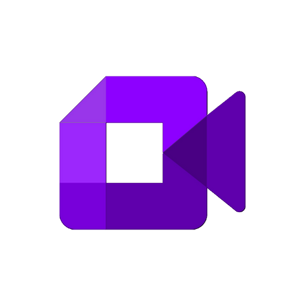

  

# EDmeet

**Français** | [English](#english)

---

## Français

EDmeet est une application de visioconférence disponible sur Windows, Linux, macOS et Android.

### Fonctionnalités

- Appels vidéo et audio en temps réel
- Salles de réunion multi-participants
- Partage d'écran
- Messagerie instantanée pendant les appels
- Connexion en temps réel via WebSocket

### Plateformes

| Plateforme | Format |
|------------|--------|
| Windows | `.exe` (installeur NSIS) |
| Linux | `.tar.gz` |
| macOS | `.dmg` |
| Android | `.apk` |

### Installation

Télécharge la dernière version depuis les [releases GitHub](https://github.com/3yezz/meet/releases).

### Stack technique

- **Interface** : React 18
- **Temps réel** : Socket.io
- **WebRTC** : mediasoup-client
- **Bureau** : Electron
- **Mobile** : Android natif (WebView)
- **Build** : electron-builder, Gradle

---

## English

EDmeet is a video conferencing application available on Windows, Linux, macOS and Android.

### Features

- Real-time video and audio calls
- Multi-participant meeting rooms
- Screen sharing
- In-call instant messaging
- Real-time connection via WebSocket

### Platforms

| Platform | Format |
|----------|--------|
| Windows | `.exe` (NSIS installer) |
| Linux | `.tar.gz` |
| macOS | `.dmg` |
| Android | `.apk` |

### Installation

Download the latest version from the [GitHub releases](https://github.com/3yezz/meet/releases).

### Tech stack

- **UI** : React 18
- **Real-time** : Socket.io
- **WebRTC** : mediasoup-client
- **Desktop** : Electron
- **Mobile** : Android native (WebView)
- **Build** : electron-builder, Gradle
